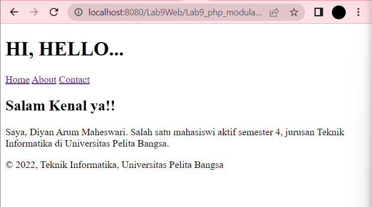

# PEMOGRAMAAN WEB

Diyan Arum Maheswari (312010133)

Teknik Informatika - UNIVERSITAS PELITA BANGSA
______________________________________________

## MENJALANKAN PROGRAM XAMPP


Pertama, nyalakanlah tombol Apache dan juga MySQL pada xampp agar semua data dan perubahan-perubahan yang terjadi dapat terhubung ke localhost.

## PEMBUATAN FOLDER

Selanjutnya, buatlah folder pada htdocs dengan nama Lab9_php_modular yang dilanjut dengan pengecekan dokumen pada localhost dengan URL : http://localhost:8080/Lab9Web/Lab9_php_modular/ 

Dan jika dokumen dapat terbaca seperti dibawah ini maka artinya sudah berhasil terhubung.


## MEMBUAT FILE HEADER, FOOTER, HOME, DAN ABOUT

Setelah kalian membuat folder diatas, selanjutnya buatlah beberapa file diantaranya yaitu header, footer, home dan juga about pada folder tersebut.


Untuk dapat membuat menu home seperti diatas dibutuhkannya kode berikut:

```php
<?php require('header.php'); ?>

<div class="content">
    <h2>Nice to meet you!!</h2>
    <p>Salam kenal ya^^</p>
</div>

<?php require('footer.php'); ?>  
```

Selanjutnya jika kalian klik pada tombol About maka akan muncul tampilan seperti ini:



Untuk membuatnya kalian memerlukan kode berikut:

```php
<?php require('header.php'); ?>

<div class="content">
    <h2>Salam Kenal ya!!</h2>
    <p>Saya, Diyan Arum Maheswari. Salah satu mahasiswi aktif semester 4, jurusan Teknik Informatika di Universitas Pelita Bangsa.</p>
</div>

<?php require('footer.php'); ?>
```

Dan terakhir pada bagian contact yang jika kalian klik akan muncul tampilan seperti ini:


Untuk membuatnya dibutuhkan kode berikut:

```php
<?php require('header.php'); ?>

<div class="content">
    <h2>Here is my social media :</h2>
    <p>Instagram : @diyanarum28</p>
    <b>Don't forget to follow! Thank you^^</b>
    
</div>

<?php require('footer.php'); ?>  
```


# PERTANYAAN DAN TUGAS

Implementasikan konsep modularisasi pada kode program praktikum 8 tentang database, sehingga setiap halamannya memiliki template tampilan yang sama.

## HASIL RUN PADA HALAMAN HOME


## HASIL RUN PADA HALAMAN TAMBAH BARANG


## HASIL RUN PADA HALAMAN UBAH BARANG


# <P align="center"> THANK'S FOR YOUR ATTENTION!! SEE YOU!!
